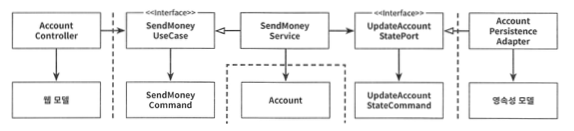

# 만들면서 배우는 클린아키텍처.md

## 4. 유스케이스 구현하기
일반적으로 유스케이스가 하는 일
1. 입력을 받는다.
2. 비즈니스 규칙을 검증한다.
3. 모델 상태를 조작한다.
4. 출력을 반환한다.

* 유스케이스는 비즈니스 규칙을 검증하는 책임이 있다. 도메인 엔티티와 이 책임을 공유한다.

**유효성 검증**
- 유스케이스 코드가 도메인 로직에만 신경 써야 하고 입력 유효성 검증으로 오염되면 안 된다고 생각한다.
- 유스케이스를 호출하는 쭉에서 검증을 한다면? 유스케이스는 하나 이상의 어댑터에서 호출될 텐데 그러면 유효성 검증을 각 어댑터에서 전부 구현해야 한다. 비효율.
- 유스케이스의 입력 모델이 스스로 검증을 하도록 하자
- 입력모델도 유스케이스 API의 일부이다. 인커밍 포트 패키지에 위치한다.

**생성자**

- 생성자가 너무 많으면 빌더 패턴을 사용하곤 한다.
- 빌더 패턴을 많이 사용하는데 단점은 빌더를 호출하는 코드에 새로운 필드를 추가하는 것을 잊을 수 있다. 즉, 필드 추가가 강제 되지 않는다.
- 요즘 IDE들은 매우 훌륭하다. 생성자도 이쁘게 잘 보여 준다.

**유스케이스마다 다른 입력 모델**

```
- 계좌 등록하기
- 계좌 정보 업데이트 하기
```
* 필드가 똑같은 계좌 상세 정보가 있는 입력 모델이 있다. 다른 유스케이스에 동일한 입력 모델을 사용하고 싶다. 

* 완벽하게 같지 않을 수 있다. 이런 경우 유스케이스에서 사용하지 않는 필드가 포함되어 있을 수 있다. 이런 필드를 검증하기 위해 검증 로직이 추가되어야 한다. 이는 관심사를 분산 시킨다.

- 각 유스케이스 전용 입력 모델은 유스케이스를 훨씬 명확하게 만든다.

**비즈니스 규칙 검증**

* 비즈니스 규칙 검증은 어떻게 규현할까? 가장 좋은 방법은 비즈니스 규칙을 도메인 엔티티 안에서 해결 하는것이다. 

**풍부한 도메인 모델**
- DDD 철학을 따르는 풍부한 도메인 모델
- 애플리케이션의 코어에 있는 엔티티에서 가능한 한 많은 도메인 로직이 구현된다.

**빈약한 도메인 모델**
* 엔티티는 상태를 표현하는 필드와 이 값을 읽고 바꾸기 위한 `getter`, `setter`메서드만 포함하고 도메인 로직이 없다. 
* 도메인 로직은 유스케이스에 구현되어 있다. 두꺼운 service

**유스케이스 마다 다른 출력**
- 유스케이스들 간에 같은 출력 모델을 공유하는 것은 유스케이스들도 강하게 결합하게 만들 수 있다. 모두 같이 변경되기 때문이다.

**읽기 전용 유스케이스**
- 읽기 전용 작업을 유스케이스라고 언급하기엔 조금 이상하다.
- CQRS

**부수효과**

* 입출력 모델을 독립적으로 모델링한다면 각 유스케이스마다 별도의 모델을 만들어야 하고 이 모델과 엔티티를 매핑해야 한다. 
* 그러나 유스케이스별 모델을 만들면 유스케이스를 명확하게 이해할 수 있고 장기적으로 유지보수하기 더 쉽다.\

## 5. 웹 어댑터 구현하기

- 애플리케이션 코어가 외부 세계와 통신하는 명세이다.
- 의존성 역전 원칙이 적용되어 있다.

## 웹어댑터의 책임

1. HTTP 요청을 자바 객체로 매핑
2. 권한 검사
3. 입력 유효성 검증
4. 입력을 유스케이스의 입력 모델로 매핑
5. 유스케이스 호출
6. 유스케이스 출력을 HTTP로 매핑
7. HTTP 응답을 반환

### Controller

- 컨트롤러 너무 적은 것보다는 너무 많은게 낫다.
    - 작은 클래스들은 더 파악하기 쉽다.
    - 테스트가 쉽다.
    - 조금 더 공수는 들지만 유지보수가 편해진다.
- 각 컨트롤러가 가능한 좁고 다른 컨트롤러와 가능한 한 적게 공유하는 웹 어댑터 조각을 구현해야 한다.
- 가급적 메서드와 클래스명은 유스케이스를 최대한 방영해서 지어야 한다.
- 대부분 request, response 객체들도 컨트롤러에 맞는 모델을 새로 만드는 것이 좋다. 그렇게 되더라
- 컨트롤러, 서비스명도 잘 생각해봐야 한다. (제일 어렵다....😥)
- HTTP요청 대해 유스케이스 메서드를 호출하고 반환한다. 어떤 도메인 로직도 수행하지 않는다.

## 6. 영속성 어댑터 구현하기


* Application 서비스와 영속성 코드 사이의 간접적인 계층이다. 
* 영속성 문제에 신경쓰지 않고 도메인 코드를 개발할 수 있게 해준다. 

### 영속성 어탭터가 하는일
1. 입력을 받는다.
2. 입력을 데이터베이스 포맷으로 매핑한다.
3. 입력을 데이터베이스로 보낸다.
4. 데이터베이스 출력을 애플리케이션 포맷으로 매핑한다.
5. 출력을 반환한다. 


* 데이터베이스 응답을 포트에 정의된 출력 모델로 매핑해서 반환한다. 
* 출력 모델이 영속성 어댑터가 아니라 애플리케이션 코어에 위치 한다. 
* 하나의 `repository`에 모두 담기보다는 인터페이스를 분리하여 작성하는게 도움이 된다.


* Aggregate 하나당 하나의 영속성 어댑터(repository)들을 나누면 좀 더 의도가 분명해 진다.
* DDD의 Bounded context의 영속성 요구사항은 분리하기 위한 좋은 토대가 돤다.
* 영속성 측면 `@Anotation` 등과 섞이지 않는 풍부한 도메인 모델을 생성하고 싶다면 모델과 영속성 모델을 매핑하는게 좋다. 
* 트랜잭션은 유스케이스에 대해서 일어나는 일에 걸쳐 있어야 한다. 그래서 실패할때 한번에 롤백될 수 있다. 
* `@Transactional` 어노테이션을 애플리케이션 서비스 클래스에 붙여준다. 


## 7. 아키텍처 요소 테스트하기
### 테스트를 작성해야한다.

- 팀의 테스트 전략이 있어야 한다.
- 테스트를 무작정 짜는 것도 결국에는 도움이 되지 않는다.


- 테스트가 좋은지 나쁜지에 따른 프로젝트 간 성장 추이이의 차이
- 테스트가 잘못 작성된 프로젝트는 초반에는 테스트가 잘 작성된 프로젝트의 속성을 보여주지만 결국 침체 단계에 빠진다.

### 테스트 피라미드


- 위로 갈수록 테스트 진행 시간은 오래걸린다.

## 단위 테스트

- 작은 코드조각을 검증한다.
- 빠르게 수행한다.
- **격리된 방식**으로 처리하는 자동화된 테스트다.

### 단위?

- **단위**를 어떻게 볼것이냐는 몇몇 시각이 있을 수 있다.
- 책에서는 하나의 클래스를 **인터페이스를 통해** 기능을 테스트 한다.
- 각각의 모든 클래스를 격리해서 테스트한다. 격리 문제에 접근하는 방식 때문에 이보다 더 클 수 없다.

## 통합 테스트

- 연결된 여러 유닛을 테스트한다.
- 각각의 유닛들이 서로 잘 연동하는지  테스트한다.
- 영속성 테스트의 경우는 testcontainer를 사용하여 실제 DB환경과 최대한 동일한 환경에서 테스트 할 수 있또록 하는게 좋다.

## 시스템 테스트

- 모든 객체 네트워크를 가동시켜 특정 유스케이스가 전 계층에 거쳐 잘 동작하는지 확인한다.
- 인수 테스트 정도로 봐도 될 것 같다.

## 얼마만큼의 테스트가 충분할까?

- 라인 커버리지가 테스트의 성공을 보장 하지는 않는다.
- 100개의 테스트를 막아도 101한번째에 버그가 생길 수 있다.
- 얼마나 마음 편하게 배포할 수 있느냐가 좋은 지표라고 볼 수 있다


## 8. 경계 간 매핑하기
### 매핑을 찬성

- 두 계층 간에 매핑을 하지 않으면 양 계층에서 같은 모델을 사용해야 하는데 이렇게 하면 두 계층이 강하게 결합된다.

### 매핑을 반대

- 두 계층 간에 매핑을 하게 되면 보일러플레이트 코드를 너무 많이 만들게 된다.
- 많은 유스케이스들이 오직 CRUD만 수행하고 계층에 걸쳐 같은 모델을 사용하기 때문에 계층 사이의 매핑은 과하다.

### 매핑하지 않는 전략 ❌


- 모든 계층에서 Account 클래스를 접근해야 할 수 있다.
- 매핑을 전혀 할 필요가 없다.
- Controller에서 REST 모델로 사용했다면 Account는 JSON 직렬화에 대한 Annotaion이 필요하다.
- ORM프레임워크를 사용한다. 데이터베이스 매핑 Annotation이 필요하다.
- 각 계층의 특수한 요구사항을 Account는 모두 수용해야 한다.
    - 단일 책임 원칙 위반.
- 단순한 CRUD의 경우는 잘 맞을 수 있다
- 모든 계층에서 정확히 같은 구조의 정보를 사용한다면 좋은 방법이 될 것이다.
- 많은 유스케이스들이 간단한 CRUD로 시작해서 시간이 지남에 따라 복잡한 매핑전략을 사용하게 될 것이다.

### 양방향 매핑 전략 ↔️

- 웹 계층에서 도메인 모델(Account)로 매핑한다.
- 웹이나, DB정보를 모르는 깨끗한 도메인 모델로 사용할 수 있다. **단일 책임 원친 만족**
- 도메인 모델이 계층 경계를 넘어서 통신하는데 사용되고 있다. 모든 계층이 도메인 모델을 알고 있다.
- 웹계층, 영속성 계층에서 매핑을 해야하므로 보일러 플레이트가 생긴다.

### 완전 매핑 전략



- 각 연산마다 별도의 입출력 모델을 사용한다.
- Command, Request, Response 등이 사용된다.
- 인터페이스들을 해석할 여지가 없이 명확하게 만들어 준다.
- 각 유스케이스는 전용필드와 유효성 검증 로직을 갖는 전용 객체를 사용한다.
- 이 매핑 전략을 전역 패턴으로 추천하지는 않는다.
- 웹 계층과 애플리케이션 계층 사이에 상태 변경 유스케이스의 경계를 명확하게 할때 빛을 발한다.
- 애플이케이션 ↔  영속성계층은 과한 측면이 있다.
- 적절히 사용해야 좋은패턴

### 단뱡향 매핑전략


- 모든 계층들이 같은 인터페이스를 구현한다.
- 관련 있는 특성 에 대한 getter 메서드를 제공해서 도메인 모델을 캡슐화 한다.
- 계층 간의 모델이 비슷할때 가장 효과 적이다.

### 언제 어떻게 적용하면 좋을까?

- 그때 그때 다르다.
- 모든 전략이 장단점이 있다.
- 아래의 어떤 전략도 철칙은 아니다.
- 하나를 선택했다고 끝까지 고수할 필요도 없다.
- 상황마다 적절한 전략을 택하고 변경하고 진화하면서 갈아타자
- 전역 규칙으로 정의하려는 충동을 이겨내자.
- 가이드정보는 만들어도 좋을것 같다.
    - 예를 들어
    - 변경 유스케이스는 **완전매핑전략**을 따르자
    - 쿼리 작업은 **양방향 전략**을 따르자


## 9. 어플리케이션 조립하기

### 조립?
- 의존성이 올바른 방향을 가리키게 하기 위해서이다.
- 도메인 코드방향으로 향해야 안전하다


- 조립은 누가 하나?
- 아키텍처에 대해 중립적이고 인스턴스 생성을 위해 모든 클래스에 대한 의존성을 가지는 설정 컴포넌트가 있어야 한다.
- 설정 컴포넌트는 제일 바깥쪽에 위치한다.
- 각 클래스의 의존성을 연결하는 클래스

### 스프링를 활용한 조립

- `@Component` 를 활용한 조립
    - 커스텀한 계층간의 Annotation을 만들어도 좋을것 같다.
    - 클래스에 프레임워크에 특화된 Annotation을 붙인다는것은 팀투적이다. 도메인 모델은 특정한 프레임워크에 종속, 결합되면 안된다라고 이야기 할 수 있겠다.
    - 애플리케이션 조립에 사용하기에 조금 둔하다
    - 코드 규모가 커지면 누가
    - 테스트를 하려고 일부만 독립적으로 띄우기 어려 울 수 있다.
- `@Bean`을 활용한 조립
    - 직접 조립할 수 있다.
    - 도메인 모델이 특정 프레임워크에 의존하지 않는다.
    - configuration 클래스가 같은 패키지에 있지 않다면 모두 public으로 풀어야한다.

## 10. 아키텍처 경계 강제하기
### 경계와 의존성

- 일정 규모 이상의 시간이 지나면 아키텍쳐가 서서히 무너지는 현상을 많이 본다.


- 가장 안쪽의 계층 도메인을 잘 지켜주는게 중요한것 같다.

### 경계를 지키는 방법

### 접근 제한자

- public, protected, package-private 를 잘 사용해주자.
- package-private 를 잘 사용하면 패키지를 통해 클래스들을 응집적인 모듈로 만들어 줄 수 있다.
- public은 어디에서나 호출될 수 있기 때문에 경계를 강제하기 쉽지 않다. (팀내 규칙등으로 관리, 리뷰로 계속 확인)


- package-private 제한자는 몇개 정도의 클래스로만 이뤄진 작은 모듈에서 가장 효과 적이다.
- 패키지에 너무 많은 클래스가 들어가면 코드를 찾기 쉽지 않아진다.
- 자바의 한계

### 컴파일 후 체크

- ArchUnit 을 사용한다.
- 의존성 규칙을 테스트 코드에 작성해 놓으면 규칙을 위반하면 테스트가 깨지게 되므로 확인할 수 있다.
- 오타등을 잘 관리해야 한다.
- 지속적으로 관리를 하지 않으면 의미 없는 작업이 되고 만다.
    - 패키지구조가 새로 생기거나 변경되면 테스트도 꼭 변경해야 한다.

### 빌드 아티팩트

- 모듈로 구분하여 계층간의 경계를 강화한다.
- 이렇게 강제하면 클래스를 아예 호출도 할 수 없어 컴파일 에러가 발생하게 된다.
- 어디까지 모듈을 나눌것인가는 적절한 선택이 필요하다.

### 마치며

- 소프트웨어 아키텍처는 아키텍처 요소간의 의존성 관리하는게 번부이다.
- 의존성을 올바른 방향으로 계속 가려면 지속적으로 확인을 해야한다.
- 아니면 강제해야 한다.


## 11. 의식적으로 지름길 사용하기
- 기술 부채를 쌓아가면서 항상 지름길의 유혹을 느낀다.
- 품질이 떨어진 코드를 넣기 시작하면 다음에 품질 않은 코드를 넣을때 죄책감이 점점 줄어든다.
- 처음부터 깨끗한 상태로 시작하는것이 좋다.
- 지름길은 경우에 따라 적절히 사용하는게 좋다. 그러나 분명히 알고 사용해야 한다.
    - 그리중요하지 않은 프로젝트
    - 프로토타이핑 작업, 빠르게 오픈하는게 목적인 경우
    

### 유스케이스 분리 예시

- 유스케이스 간 다른 입출력을 사용하는게 좋다고 한다.
- 경우에 따라서는 진짜 두 유스케이스에 영향이 경우도 있다. 이럴때는 적절히 사용할 수 도 있다.

### dto 생략하기

- 도메인 엔티티를 입출력 모델로 사용하기
    - 유스케이스가 복잡해 질수록 나중에는 구분해주는게 좋다.
- 인커밍 포트 건너 뛰기
    - 생략한다면 구현 어플리케이션의 내부 동작을 더 잘 알게 된다.
    - 전용포트를 사용하면 진입점을 식별 할 수 있다.
    - 규모가 작을 때는 생략하는게 좋을 수도 있다. 그러나 규모가 커지면 변경하는게 좋을 수 있다.
        - 구현체가 하나밖에 없다고 확신할 수 없으니까

### Application 서비스 건너뛰기

- service를 건너뛰고 바로 PersistenceAdapter를 호출하는게 좋다고 보여지기도 한다.
- 역시 CRUD의 유스케이스가 복잡해지면 애매해진다.
    - 도메인 로직을 어디에 어떻게 사용해야 될까>
    - 경계가 복잡해진다.
- 이것도 정말 단순한 CRUD라면 그럴수 있다.
    - 그러나 어느정도 CRUD의 로직이 복잡해지면 service를 사용해야 한다는 규칙은 필요하다.

### 마무리

- 예외를 있을 수 있지만 이유 없이 있는 예외는 위험하다.
- 장기적으로 지속가능한 아키텍처로 변경해 가는게 중요하다.
- 현재 왜 이런 아키텍처를 사용했는지 기록으 남겨가는 것도 좋은것 같다.


## 12. 아키텍처 스타일 결정하기
### 도메인 짱짱맨

- 외부의 영향을 받지 않고 도메인 코드를 자유롭게 발전시킬 수 있다는 것은 육가형 아키텍처 스타일이 내세우는 가장 중요한 가치이다.
- 도메인 주도 개발과 잘 어울린다.
- 설계가 외부 요소들에 주도 되지 않아야 한다.

### 그때그때 다르다

- 어떤 아키텍처 스타일을 선택해야 하는가는 그때그때 다르다.
- 다양하게 경험하고 좋은 아키텍처를 만들어가자