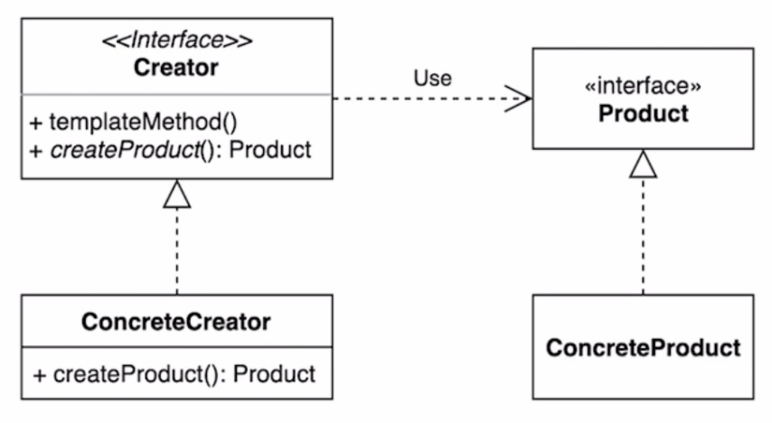

# 팩토리 메소드
## 기본적인 구
다양한 구현체가 있고 그중에서 특정한 구현체를 만들 수 있는 다양한 팩토리를 제공할 수 있다. 


- 생성을 담당하는 객체를 구분해 준다.
- 생성시 중복되는 부분을 재사용할 수 있다.
- 여러 객체를 생성시 기존 객체의 변경을 막을 수 있다. (OCP)

## Simple Facotory pattern

위 모습이 약간 생소 할 수 있는데 위처럼 확장될 수 있다고 보면 될것 같다. 

흔히 사용되는 코드는 method의 인자를 통해 입력되면 인자에 매칭되는 각각의 객체를 생성해주는 함수를 많이 사용하곤 했다. 

```java
public Product getProduct(String name) {
	if("".equals(name)) {
		return ProductA();
	} else 	if("".equals(name)) {
		return ProductB();
	} else {
		return DefaultProduct();
	}
}
```